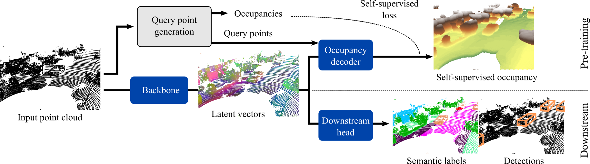

<div align='center'>

# ALSO: Automotive Lidar Self-supervision by Occupancy estimation

Alexandre Boulch &nbsp;&nbsp;&nbsp;
Corentin Sautier &nbsp;&nbsp;&nbsp;
Björn Michele &nbsp;&nbsp;&nbsp;
Gilles Puy &nbsp;&nbsp;&nbsp;
Renaud Marlet

[]()




This is the reference PyTorch implementation for training and testing self-supervision for automotive lidar point cloud using the method described in our paper [**ALSO: Automotive Lidar Self-supervision by Occupancy estimation**]()

</div>

## Overview

- [Dependencies](#dependencies)
- [Installation](#installation)
- [Pre-training](#pre-training)
- [Downstream](#downstream)
- [Pre-trained models](#pre-trained-models)
- [Performances](#performances)
- [Acknowledgments](#acknowledgments)

---

## Dependencies

We give the library version(s), we used for experiments.

- Hydra (1.2.0)
- Pytorch-geometric (2.1.0)
- Pytorch-Lightning (1.7.2)

*Semantic segmentation specific libraries*
- torchsparse (1.4.0)

*Detection specific libraries*
- spconv (2.1.21)
- openpcdet (0.6.0)

## Installation

At root of the folder run:
```
pip install -ve .
```
Then all scripts can be run from `also_selfsup` folder:
```
cd also_selfsup
```


### Semantic segmentation

### Pre-training


```
python train_selfsupervised.py cfg=nuscenes
```

for a pre-training on [nuScenes](https://www.nuscenes.org/nuscenes).

for other datasets, replace `cfg=nuscenes` by the desired dataset
- [nuScenes](https://www.nuscenes.org/nuscenes): `cfg=nuscenes`
- [SemanticKITTI](https://www.nuscenes.org/nuscenes): `cfg=semantickitti`
- [SemanticPOSS](http://www.poss.pku.edu.cn/semanticposs.html): *To be added*
- [LivoxSimuDataset](https://www.livoxtech.com/simu-dataset): *To be added*

#### Parameters

We use [Hydra](https://hydra.cc/) for easy configuration of trainings.
The pretraining parameters are set for pre-training with a NVidia-V100 16Gb.
In order to pre-train on other configurations, one can modify parameters directly in the command line, e.g., setting the batch size to 8:
```
python train_selfsupervised.py ... cfg.training.batch_size=8
```
or the backbone to SPVCNN:
```
python train_selfsupervised.py ... cfg.network.backbone=SPVCNN
```

### Downstream

#### From scratch

```bash

# 100%
python train_downstream_semseg.py cfg=nuscenes cfg.downstream.max_epochs=30 cfg.val_interval=5 cfg.downstream.skip_ratio=1

# 50%
python train_downstream_semseg.py cfg=nuscenes cfg.downstream.max_epochs=50 cfg.val_interval=5 cfg.downstream.skip_ratio=2

# 10%
python train_downstream_semseg.py cfg=nuscenes cfg.downstream.max_epochs=100 cfg.val_interval=10 cfg.downstream.skip_ratio=10

# 1%
python train_downstream_semseg.py cfg=nuscenes cfg.downstream.max_epochs=500 cfg.val_interval=50 cfg.downstream.skip_ratio=100

# 0.1%
python train_downstream_semseg.py cfg=nuscenes cfg.downstream.max_epochs=1000 cfg.val_interval=100 cfg.downstream.skip_ratio=1000
```

#### With pretrained models

First, convert the pre-trained model to be loaded
```bash
python convert_models.py --ckpt path_to_pretraining_checkpoint
```

Second, run downstream training
```bash
python train_downstream_semseg.py cfg=nuscenes cfg.downstream.checkpoint_dir='path_to_checkpoint_directory' cfg.downstream.checkpoint_name='pretrained_backbone_XXX.ckpt'
```

#### Evaluation of downstream models

First, convert the trained model to be loaded
```bash
python convert_models.py --downstream --ckpt path_to_downstream_checkpoint
```

Second, run the evaluation script
```bash
python eval.py --split val --config path_to_downstream_model/config.yaml --ckpt path_to_downstream_checkpoint/trained_model_XXX.ckpt
```

## Pre-trained models

Task | Dataset | Model | Link |
---|---|---|---|
Semantic segmentation | nuScenes | MinkUNet34   | download |
&nbsp; | &nbsp; | SPVCNN     | download |
&nbsp; | SemanticKITTI | MinkUNet18SC  | download |
&nbsp; | &nbsp; | SPVCNN     | download |


Here are links to pre-trained models

## Performances

## Acknowledgments

This project would not have been possible without many community ressources and repositories. Among them:

- [PointContrast](https://github.com/facebookresearch/PointContrast)
- [SLidR](https://github.com/valeoai/SLidR)
- [SegContrast](https://github.com/PRBonn/segcontrast)
- [SPVNAS](https://github.com/mit-han-lab/spvnas)
- [POCO](https://github.com/valeoai/POCO)

Please, consider acknowleding these project.